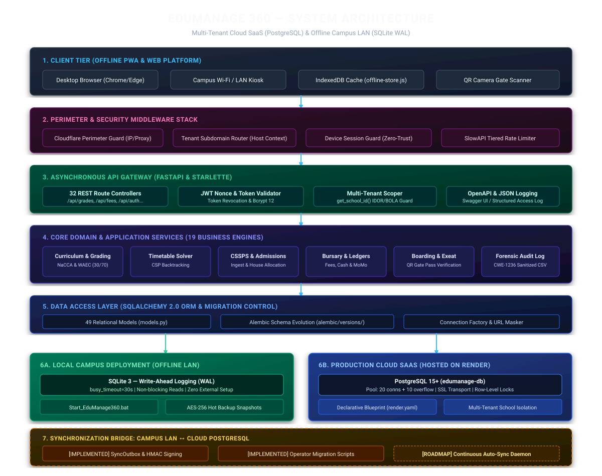
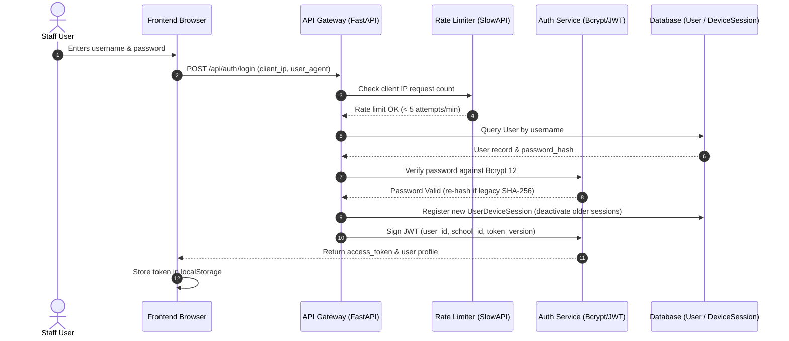
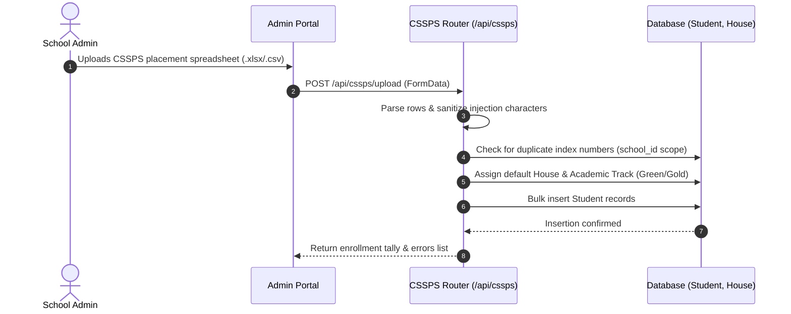
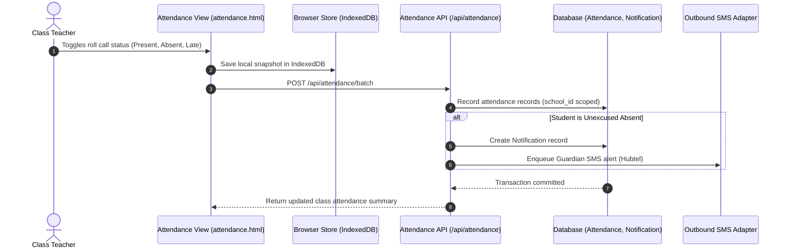
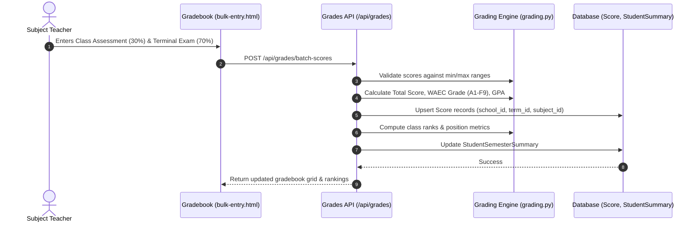
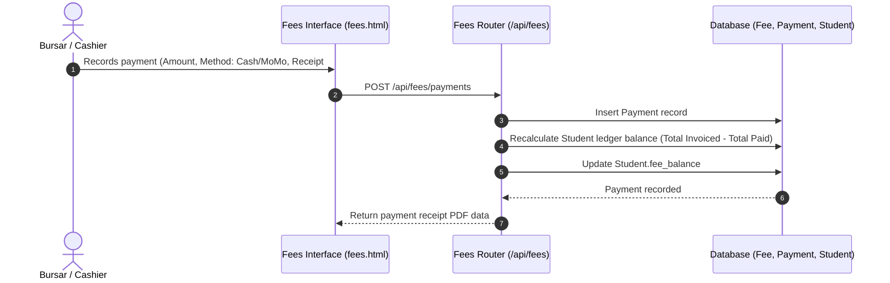
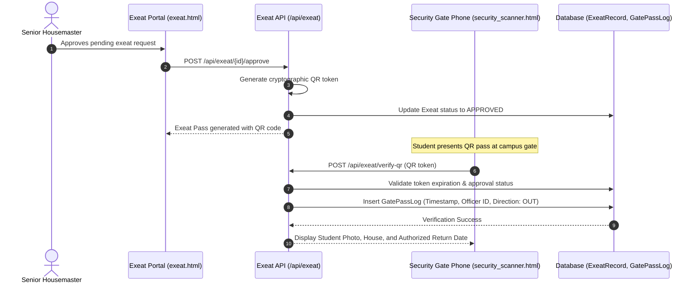
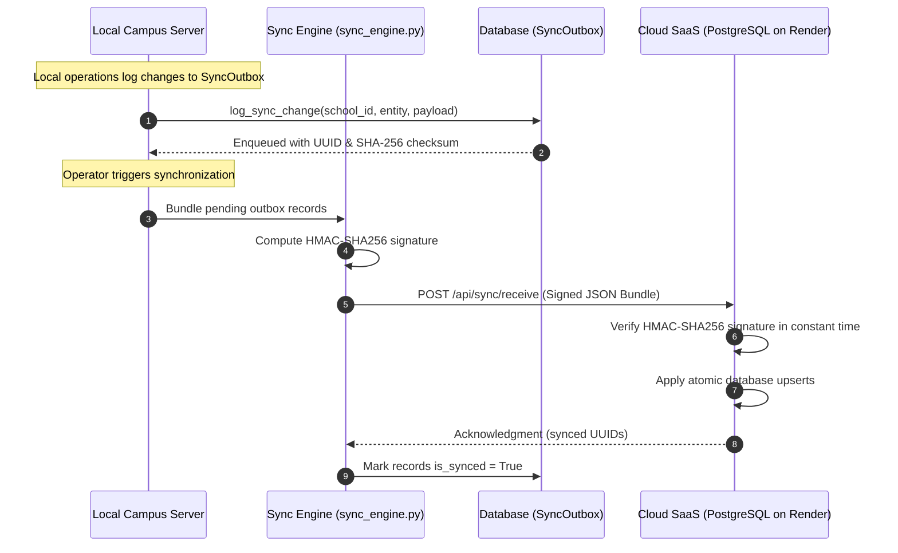

# EduManage 360 — System Architecture Documentation

<div align="center">



**Formal Technical Architecture, Component Topology, and Data Flow Specification**

</div>

---

## 1. Architecture Overview

**EduManage 360** is an institutional School Management System (SMS) and Enterprise Resource Planning (ERP) platform engineered for Basic Schools, Senior High Schools (SHS), Technical/Vocational Institutes (TVET), and Multi-Campus Educational Networks across Ghana and West Africa.

### Architectural Philosophy: Offline-First Hybrid Operation
Unlike conventional web-only education portals that assume persistent cloud connectivity, EduManage 360 is engineered with a **dual operational topology**:
1. **Local Campus Tier (Offline LAN)**: Fully self-contained local installation running on campus server or PC hardware over a local Wi-Fi router or switch. In this mode, the system operates against an embedded SQLite 3 engine configured in Write-Ahead Logging (WAL) mode. Administrative operations (roll call, gradebook entry, report card generation, cashier receipting, and gate security) execute without internet access.
2. **Cloud Tier (Multi-School Cloud SaaS)**: Centralized multi-tenant SaaS deployment hosted on **Render** backed by a managed **PostgreSQL 15+** database. In this mode, the system serves multi-campus directorates, synchronizes remote school records, and provides parent and administrative oversight.

### Core Architectural Characteristics
* **Asynchronous API Framework**: Python 3.10+ powered by **FastAPI** and **Starlette**, providing non-blocking request handling, automated OpenAPI schema generation, and strict dependency injection.
* **Shared-Schema Multi-Tenancy**: Application-level tenant isolation scoping all school data via foreign keys (`school_id`), enforced cryptographically via signed JWT claims and anti-spoofing middleware.
* **Zero-Build Frontend Architecture**: Modular HTML5, CSS3, and modern Vanilla ES6+ JavaScript, eliminating Node.js runtime build steps and enabling instant local browser caching.
* **Declarative Schema Evolution**: All database tables, indexes, and constraints are version-controlled using **Alembic** migrations.

---

## 2. System Context & Actors

The system interacts with concrete human actors and external services, each bounded by strict role-based access controls:

```
                            ┌─────────────────────────────────┐
                            │    Cloudflare Edge Perimeter    │
                            │   (Turnstile Bot & IP Guard)    │
                            └────────────────┬────────────────┘
                                             │
                       ┌─────────────────────┴─────────────────────┐
                       ▼                                           ▼
         ┌───────────────────────────┐               ┌───────────────────────────┐
         │  Cloud / Remote Clients   │               │   Campus Local Clients    │
         │  (Broadband / Cellular)   │               │   (Offline Wi-Fi / LAN)   │
         └─────────────┬─────────────┘               └─────────────┬─────────────┘
                       │                                           │
                       └─────────────────────┬─────────────────────┘
                                             ▼
                             ┌───────────────────────────────┐
                             │     EduManage 360 Platform    │
                             └───────────────┬───────────────┘
                                             │
      ┌──────────────────┬───────────────────┼───────────────────┬──────────────────┐
      ▼                  ▼                   ▼                   ▼                  ▼
┌───────────┐      ┌───────────┐       ┌───────────┐       ┌───────────┐      ┌───────────┐
│Super-Admin│      │School Lead│       │ Teachers  │       │ Financial │      │ Security  │
│(Governance│      │(Headmaster│       │(Grading / │       │(Bursars / │      │(Exeat QR  │
│& Tenancy) │      │& Admins)  │       │Roll Call) │       │ Cashiers) │      │ Scanner)  │
└───────────┘      └───────────┘       └───────────┘       └───────────┘      └───────────┘
```

### Verified Actors & Boundaries

| Actor | Access Scope | Operational Boundaries | Implementation Enforcement |
|---|---|---|---|
| **Super Administrator** | Platform-wide | Onboards schools, manages subscriptions, monitors system telemetry, triggers cross-tenant sync. | `role="super_admin"`, verified in [`backend/app/dependencies.py`](../backend/app/dependencies.py). |
| **School Leadership** (`headmaster`, `school_admin`) | Tenant-scoped | Approves final report cards, configures academic terms, manages staff directory, oversees school ledgers. | Locked to `user.school_id` via `get_school_id()`. |
| **Teaching Faculty** (`teacher`, `form_master`) | Class/Subject-scoped | Enters continuous assessments (SBA), records daily register roll call, submits terminal remarks. | Scoped via `get_user_assigned_scope()` in [`backend/app/dependencies.py`](../backend/app/dependencies.py). |
| **Bursary Staff** (`accountant`, `cashier`) | Financial-scoped | Defines fee schedules, collects payments, issues receipts, tracks student arrears. | Read-only to grades; write access strictly to `/api/fees`. |
| **Campus Security** (`security_officer`) | Security-scoped | Uses camera scanner at school gates to validate student exeat passes and record gate movements. | Restricted to [`frontend/exeat.html`](../frontend/exeat.html) and `/api/exeat/verify-qr`. |
| **Students & Guardians** | Self-scoped | Views terminal report cards, fee balances, attendance records, and announcements. | Strictly isolated to personal records via student user ID. |
| **External Integrations** | Webhook / API | Hubtel SMS gateway (parent notifications), Paystack (card/MoMo payments), Cloudflare (perimeter defense). | Outbound HTTP clients with mocked fallbacks for offline mode. |

---

## 3. High-Level System Architecture

The runtime request pipeline flows through distinct, decoupled layers:

```
[ Client Browser / PWA ] ──(HTTP/HTTPS)──> [ Cloudflare / Reverse Proxy ]
                                                    │
                                                    ▼
                                      [ Security Middleware Stack ]
                                      - CloudflareGuardMiddleware
                                      - TenantSubdomainMiddleware
                                      - DeviceSessionGuardMiddleware
                                      - SlowAPI Rate Limiter
                                                    │
                                                    ▼
                                      [ FastAPI API Gateway ]
                                      - Routing across 32 controllers
                                      - Dependency Injection (get_db, get_current_user)
                                      - Request Logging (X-Request-ID)
                                                    │
                                                    ▼
                                      [ Core Application Services ]
                                      - Grading Engine (NaCCA / WAEC)
                                      - Timetable CSP Solver
                                      - CSSPS Admissions Engine
                                      - Bursary & Ledger Orchestrator
                                      - Sync Engine (HMAC / Outbox)
                                                    │
                                                    ▼
                                      [ Data Access Layer (SQLAlchemy 2.0) ]
                                      - 49 Relational Models
                                      - Multi-Tenant Scoping (school_id)
                                      - Connection Pool / PRAGMA WAL
                                                    │
                           ┌────────────────────────┴────────────────────────┐
                           ▼                                                 ▼
             [ Local Campus Tier ]                             [ Cloud SaaS Tier ]
             SQLite 3 (WAL Mode)                               PostgreSQL 15+ (Render)
             Zero-conf, 30s timeout                            Multi-worker pooled
```

---

## 4. Component Architecture

The backend codebase is organized modularly under [`backend/app/`](../backend/app/):

```
backend/app/
├── core/                  # Security primitives, password hashing, and token cryptography
├── db/                    # Session management and engine initialization
├── middleware/            # Edge perimeter, zero-trust session, and subdomain routing
├── payments/              # Payment gateway adapters (Paystack)
├── routes/                # 32 modular REST API route controllers
├── services/              # 19 business logic engines
├── sms/                   # Outbound SMS gateway adapters (Hubtel, Arkesel)
├── database.py            # Dual-engine connection adapter and failover management
├── dependencies.py        # Authentication dependencies, rate limiters, tenant scopers
├── models.py              # 49 SQLAlchemy relational database models
└── schemas.py             # Pydantic v2 request and response validation schemas
```

### Verified System Components

| Component | Responsibility | Repository Location | Technology | Current Status |
|---|---|---|---|---|
| **API Gateway** | Request dispatching, error translation, OpenAPI docs | [`backend/app/main.py`](../backend/app/main.py) | FastAPI 0.100+ | **IMPLEMENTED** |
| **Authentication Service** | Password hashing (Bcrypt 12), token signing, legacy hash migration | [`backend/app/services/auth.py`](../backend/app/services/auth.py), [`backend/app/routes/auth.py`](../backend/app/routes/auth.py) | Passlib, PyJWT | **IMPLEMENTED** |
| **Zero-Trust Device Guard** | Single active session enforcement for staff accounts | [`backend/app/middleware/device_session_guard.py`](../backend/app/middleware/device_session_guard.py) | SQLAlchemy | **IMPLEMENTED** |
| **Tenant Subdomain Router** | Dynamic school context injection from Host header | [`backend/app/middleware/tenant_subdomain.py`](../backend/app/middleware/tenant_subdomain.py) | Starlette Middleware | **IMPLEMENTED** |
| **Dual Database Adapter** | Resilient SQLite WAL vs. PostgreSQL connection pool | [`backend/app/database.py`](../backend/app/database.py) | SQLAlchemy 2.0 | **IMPLEMENTED** |
| **Schema Evolution** | Version-controlled DDL migration revisions | [`backend/alembic/versions/`](../backend/alembic/versions/) | Alembic | **IMPLEMENTED** |
| **Grading & Assessment** | Continuous Assessment (SBA) and terminal WAEC calculations | [`backend/app/services/grading.py`](../backend/app/services/grading.py) | Python Core Service | **IMPLEMENTED** |
| **Timetable Solver** | Constraint-satisfaction heuristic schedule builder | [`backend/app/services/timetable_generator.py`](../backend/app/services/timetable_generator.py) | Backtracking Heuristic | **IMPLEMENTED** |
| **CSSPS Admissions** | Ingestion of national placement spreadsheets | [`backend/app/routes/cssps_enrollment.py`](../backend/app/routes/cssps_enrollment.py) | OpenPyXL / CSV | **IMPLEMENTED** |
| **Bursary & Ledgers** | Fee schedules, payments, student account ledgers | [`backend/app/routes/fees.py`](../backend/app/routes/fees.py), [`backend/app/models.py`](../backend/app/models.py) | SQLAlchemy | **IMPLEMENTED** |
| **Boarding & Exeat** | Leave approval workflows, QR gate pass verification | [`backend/app/routes/exeat.py`](../backend/app/routes/exeat.py) | Python, HTML5-QRCode | **IMPLEMENTED** |
| **Sync Engine** | Change logging, HMAC payload signing, bundle export/import | [`backend/app/services/sync_engine.py`](../backend/app/services/sync_engine.py), [`backend/app/routes/sync.py`](../backend/app/routes/sync.py) | HMAC-SHA256 | **IMPLEMENTED** |
| **Client Offline Store** | In-browser offline grading and roll call cache | [`frontend/js/offline-store.js`](../frontend/js/offline-store.js), [`frontend/js/syncManager.js`](../frontend/js/syncManager.js) | Browser IndexedDB | **IMPLEMENTED** |
| **Forensic Audit Ledger** | Immutable audit trail, sanitized CSV exports | [`backend/app/routes/audit.py`](../backend/app/routes/audit.py), [`backend/app/services/audit.py`](../backend/app/services/audit.py) | SQLAlchemy | **IMPLEMENTED** |
| **Automated Delta Daemon** | Continuous automated background sync between LAN and Cloud | *Not yet running as a continuous background daemon* | Background Worker Daemon | **ROADMAP** |

---

## 5. Multi-Tenant Architecture

EduManage 360 uses **application-level shared-schema multi-tenancy**:

```
                               ┌────────────────────────────────────────────────────────┐
                               │                    Incoming Request                    │
                               └───────────────────────────┬────────────────────────────┘
                                                           │
                                                           ▼
                                           ┌───────────────────────────────┐
                                           │   get_school_id Dependency    │
                                           │  (backend/app/dependencies.py)│
                                           └───────────────┬───────────────┘
                                                           │
                             ┌─────────────────────────────┴─────────────────────────────┐
                             │                                                           │
                  Is User Authenticated?                                     Is User Unauthenticated?
                             │                                                           │
             ┌───────────────┴───────────────┐                       ┌───────────────────┴───────────────────┐
             ▼                               ▼                       ▼                                       ▼
    Role == "super_admin"            Standard Staff/User       Has X-School-Id?                    Has Subdomain Context?
             │                               │                       │                                       │
     Allows X-School-Id             STRICTLY LOCKED to         Extracts Header                    Resolves Host header via
     or Subdomain Context          current_user.school_id     (e.g., Public Portal)             TenantSubdomainMiddleware
   (Context Switching Permitted)   (Rejects Spoofed Headers)
```

### Multi-Tenant Isolation Enforcement
1. **Foreign Key Integrity**: Every tenant-scoped entity (`Student`, `Score`, `Fee`, `Attendance`, `ClassSection`, `User`, `ExeatRecord`) includes a foreign key constraint referencing `School.id`:
   ```python
   school_id = Column(Integer, ForeignKey("schools.id", ondelete="CASCADE"), nullable=False, index=True)
   ```
2. **Broken Object-Level Authorization (BOLA/IDOR) Defense**:
   In [`backend/app/dependencies.py`](../backend/app/dependencies.py#L70-L111), the `get_school_id` dependency inspects the authenticated session:
   * If the user is an ordinary school administrator, teacher, or student, queries are strictly constrained to `current_user.school_id`. Any client attempt to inject an unauthorized `X-School-Id` header is ignored.
   * Only verified `super_admin` sessions can override `school_id` to inspect or maintain different schools.
3. **Subdomain Resolution**:
   [`backend/app/middleware/tenant_subdomain.py`](../backend/app/middleware/tenant_subdomain.py) dynamically inspects the HTTP `Host` header. Incoming requests such as `achimoto.sms.edu.gh` query the `schools` table for `slug = 'achimoto'` and bind the resulting tenant ID to `request.state.school_id`.

---

## 6. Authentication & Authorization Architecture

### 1. Password Hashing & Legacy Migration
* **Algorithm**: Passwords are saved with salted **Bcrypt** using 12 work factor rounds ([`backend/app/services/auth.py`](../backend/app/services/auth.py)).
* **Legacy Hash Sunset**: A verification hook inspects existing hashes on login. If an account has an older SHA-256 hash, it is transparently re-hashed using Bcrypt and updated in the database upon successful authentication.
* **Cryptographic Random Credentials**: All programmatic password resets generate high-entropy tokens using `secrets.token_urlsafe(16)` with mixed-case, digit, and special character validation.

### 2. Session Integrity & Single-Device Zero-Trust Guard
* **JWT Access Tokens**: Cryptographically signed using HMAC-SHA256 (`PyJWT`) with configurable expiration (`ACCESS_TOKEN_EXPIRE_MINUTES`).
* **Instant Session Invalidation**: User records contain a `token_version` integer. When an administrator resets an account or a user changes their password, `token_version` increments, instantly invalidating all tokens issued prior to that timestamp.
* **Zero-Trust Multi-Device Guard**:
  [`backend/app/middleware/device_session_guard.py`](../backend/app/middleware/device_session_guard.py) enforces a single active session for institutional staff (`admin`, `headmaster`, `teacher`, `accountant`). Logging in on a second device terminates the earlier session in `UserDeviceSession`.

### 3. Role-Based Access Control (RBAC)
The platform defines **26 granular roles** in [`backend/app/routes/auth.py`](../backend/app/routes/auth.py):
* **Platform Governance**: `super_admin`
* **Executive Leadership**: `headmaster`, `headmistress`, `assistant_headmaster_academic`, `assistant_headmaster_admin`, `assistant_headmaster_domestic`, `school_administrator`, `proprietor`
* **Departmental Heads**: `hod`, `academic_head`, `senior_housemaster`, `senior_housemistress`
* **Teaching Faculty**: `teacher`, `form_master`, `form_mistress`, `subject_master`, `house_master`, `house_mistress`, `ict_coordinator`
* **Bursary Operations**: `accountant`, `cashier`, `bursar`
* **Campus Services**: `librarian`, `nurse`, `security_officer`, `storekeeper`
* **End Users**: `student`, `parent`, `alumni`

---

## 7. Database Architecture

EduManage 360 dynamically adapts its persistence tier via [`backend/app/database.py`](../backend/app/database.py):

```
                               ┌────────────────────────────────────────────────────────┐
                               │             DATABASE_URL Configuration                 │
                               └───────────────────────────┬────────────────────────────┘
                                                           │
                             ┌─────────────────────────────┴─────────────────────────────┐
                             ▼                                                           ▼
               StartsWith "postgresql://"                                    StartsWith "sqlite://"
                             │                                                           │
                             ▼                                                           ▼
             ┌───────────────────────────────┐                           ┌───────────────────────────────┐
             │       PostgreSQL Engine       │                           │         SQLite Engine         │
             │       (Cloud Production)      │                           │      (Campus Offline LAN)     │
             └───────────────┬───────────────┘                           └───────────────┬───────────────┘
                             │                                                           │
             - pool_size = 20                                            - check_same_thread = False
             - max_overflow = 10                                         - timeout = 30 seconds
             - pool_timeout = 30s                                        - PRAGMA journal_mode = WAL
             - pool_recycle = 1800s                                      - PRAGMA synchronous = NORMAL
             - pool_pre_ping = True                                      - PRAGMA foreign_keys = ON
             - connect_timeout = 10s                                     - PRAGMA busy_timeout = 30000
```

### Local Campus Tier: SQLite Write-Ahead Logging (WAL)
When running on campus LANs:
1. `PRAGMA journal_mode=WAL;` allows concurrent readers to read from the database without blocking write transactions.
2. `PRAGMA busy_timeout=30000;` instructs database connections to wait up to 30 seconds for locks to clear before returning a busy exception.
3. `PRAGMA foreign_keys=ON;` enforces referential integrity for cascading deletes and updates.

### Cloud Production Tier: PostgreSQL Connection Pooling
When deployed on Render:
1. SQLAlchemy manages a connection pool (`pool_size=20`, `max_overflow=10`).
2. `pool_pre_ping=True` ensures stale or severed database connections are transparently recycled before executing application queries.
3. Production runtime fail-secure: If PostgreSQL is unreachable in `ENVIRONMENT=production`, the application exits safely unless `DB_ALLOW_SQLITE_FALLBACK=true` is explicitly set.

### Schema Versioning via Alembic
Database schema updates are managed through version-controlled migration scripts in [`backend/alembic/versions/`](../backend/alembic/versions/):
* `0001_initial_schema_baseline.py`: Baseline tables and relationships.
* `0002_database_constraints_and_integrity.py`: Production constraint validation, indexes, and cascades.

---

## 8. Offline & Local Network Architecture

EduManage 360 provides local campus execution:

```
                            ┌─────────────────────────────────┐
                            │    Central Campus Server / PC   │
                            │   (Running Start_EduManage360)  │
                            └────────────────┬────────────────┘
                                             │ Bound to 0.0.0.0:8000
                                             ▼
                             ┌───────────────────────────────┐
                             │   Campus Wi-Fi Router/Switch  │
                             │  (Local LAN: 192.168.1.100)   │
                             └───────────────┬───────────────┘
                                             │
      ┌──────────────────────────────┬───────┴──────────────────────┬──────────────────────────────┐
      ▼                              ▼                              ▼                              ▼
┌──────────────┐               ┌──────────────┐               ┌──────────────┐               ┌──────────────┐
│  Admin PC    │               │ Teacher Tab  │               │ Bursary PC   │               │ Gate Phone   │
│(Headmaster)  │               │(Roll Call)   │               │(Fees / Cash) │               │(QR Scanner)  │
└──────────────┘               └──────────────┘               └──────────────┘               └──────────────┘
```

### 1. Zero-Configuration Local Launcher
Campus deployments utilize [`Start_EduManage360.bat`](../Start_EduManage360.bat):
* Validates Python 3.10+ runtime.
* Creates or activates `.venv` virtual environment.
* Runs pending Alembic migrations (`alembic upgrade head`).
* Launches Uvicorn bound to `0.0.0.0:8000` to allow multi-device LAN access.

### 2. Browser Client Offline Cache (IndexedDB)
[`frontend/js/offline-store.js`](../frontend/js/offline-store.js) initializes client-side IndexedDB storage (`SMS_Offline_Store_v1`). If a teacher experiences a temporary Wi-Fi disconnect during roll call or score entry:
* Records are stored in IndexedDB.
* [`frontend/js/syncManager.js`](../frontend/js/syncManager.js) listens for the `online` network event and pushes queued transactions to `/api/sync/push`.

### 3. Server-Side Sync Engine & Outbox Ledger
[`backend/app/services/sync_engine.py`](../backend/app/services/sync_engine.py) provides delta synchronization:
* **Outbox Tracking**: Modifications to core entities (`Student`, `Score`, `Fee`, `Attendance`) are enqueued into `SyncOutbox` with a UUID and SHA-256 payload checksum.
* **Cryptographic Signing**: Payloads are signed via HMAC-SHA256 (`sign_sync_payload()`) using a shared institutional secret.
* **Cloud Reception**: Cloud endpoints verify signatures in constant time (`verify_sync_signature()`) and apply atomic database transactions.
* **Roadmap Status**: Automated continuous background synchronization is under active development. Current synchronization is executed via operator scripts ([`scripts/migrate_to_postgres.py`](../scripts/migrate_to_postgres.py), [`scripts/pull_cloud_database.py`](../scripts/pull_cloud_database.py)) or manual API triggers.

---

## 9. API Architecture

The FastAPI application mounts 32 modular domain routers with prefix `/api`:

| Route Module | URL Prefix | Domain Responsibilities |
|---|---|---|
| [`auth.py`](../backend/app/routes/auth.py) | `/api/auth` | Login, token refresh, password resets, session status |
| [`settings.py`](../backend/app/routes/settings.py) | `/api/settings` | School profiles, branding, operational settings |
| [`students.py`](../backend/app/routes/students.py) | `/api/students` | Student enrollment, guardian data, health profiles |
| [`results.py`](../backend/app/routes/results.py) | `/api/results` | Score entry, continuous assessments, broadsheets |
| [`reports.py`](../backend/app/routes/reports.py) | `/api/reports` | Terminal report card generation, PDF exports |
| [`fees.py`](../backend/app/routes/fees.py) | `/api/fees` | Fee schedules, payments, receipts, ledger statements |
| [`attendance.py`](../backend/app/routes/attendance.py) | `/api/attendance` | Roll call, subject attendance, truancy alerts |
| [`timetable.py`](../backend/app/routes/timetable.py) | `/api/timetables` | Automated CSP timetable generation, class periods |
| [`cssps_enrollment.py`](../backend/app/routes/cssps_enrollment.py) | `/api/cssps` | Placement spreadsheet ingestion, auto-enrollment |
| [`exeat.py`](../backend/app/routes/exeat.py) | `/api/exeat` | Exeat approvals, security gate QR verification |
| [`audit.py`](../backend/app/routes/audit.py) | `/api/audit` | Immutable audit feed, sanitized CSV exports |
| [`backup.py`](../backend/app/routes/backup.py) | `/api/backups` | Hot online backups, AES-256 encryption, restore |
| [`sync.py`](../backend/app/routes/sync.py) | `/api/sync` | Sync outbox status, HMAC push/receive, snapshots |
| [`super_admin.py`](../backend/app/routes/super_admin.py) | `/api/super-admin` | Multi-school portal, tenant lifecycle, telemetry |

The interactive OpenAPI documentation is automatically served at `/docs` (Swagger UI) and `/redoc` (ReDoc).

---

## 10. Frontend Architecture

EduManage 360 uses a lightweight, **zero-build** frontend architecture:
* **Structure**: 36 role-specific HTML interfaces in [`frontend/`](../frontend/) (`dashboard.html`, `attendance.html`, `results.html`, `fees.html`, `exeat.html`, `super-admin.html`).
* **JavaScript Architecture**: Modular Vanilla ES6+ files in [`frontend/js/`](../frontend/js/):
  * `app.js`: Global application shell, navigation, and theme initialization.
  * `guard.js`: Client-side route protection, JWT token inspection, and session timeout detection.
  * `stateBus.js`: Event pub/sub bus for cross-component UI state synchronization.
  * `offline-store.js`: IndexedDB engine for offline data persistence.
  * `syncManager.js`: Client store-and-forward queue manager.
  * `commandPalette.js`: Global keyboard search navigation (`Ctrl + K`).
* **Styling**: Pre-compiled Vanilla CSS (`frontend/css/`) utilizing custom CSS design tokens with support for dark/light themes.

---

## 11. Security Architecture

Security controls are layered throughout the application lifecycle:

```
[ Visitor / Client ]
        │
        ▼  [1. Edge Perimeter] CloudflareGuard (Turnstile Bot Defense, CF-Connecting-IP)
        │
        ▼  [2. Transport Layer] HTTPS/SSL Enforced, HSTS, Strict CORS Whitelist
        │
        ▼  [3. Network Perimeter] SlowAPI Rate Limiting (5 login attempts / 60s window)
        │
        ▼  [4. Session Layer] Zero-Trust Multi-Device Guard, Single Active Session per Staff
        │
        ▼  [5. Identity Layer] Salted Bcrypt 12, SHA-256 Auto-Migration, JWT Nonces
        │
        ▼  [6. Authorization Layer] 26-Role RBAC, Tenant BOLA/IDOR Scoping (school_id)
        │
        ▼  [7. Data Storage Layer] SQL Parameterization, CSV Sanitization (CWE-1236), AES-256 Backups
```

* **Perimeter Defense**: [`backend/app/middleware/cloudflare_guard.py`](../backend/app/middleware/cloudflare_guard.py) validates authentic visitor IP addresses and validates Cloudflare Turnstile tokens.
* **Brute-Force Rate Limiting**: In-memory sliding-window limiter throttles `/api/auth/login` to 5 requests per minute per IP.
* **CORS Whitelisting**: Strict origin validation configured via `CORS_ORIGINS`. Wildcards (`*`) are disallowed when cookies/credentials are enabled.
* **CSV Formula Injection Mitigation (CWE-1236)**: Gradebook and audit CSV exports sanitize cells prefixed with `=`, `+`, `-`, or `@` by prepending `'`.
* **Cryptographic Backup Security**: Backups support AES-256 envelope encryption (`cryptography.fernet`) and generate companion SHA-256 checksums.

---

## 12. Data Flow Diagrams

### Flow A: User Authentication & Zero-Trust Session Verification


### Flow B: CSSPS Intake & Student Enrollment


### Flow C: Attendance Roll Call & Absentee Escalation


### Flow D: Assessment Entry & WAEC Terminal Calculations


### Flow E: Fee Billing & Student Ledger Reconciliation


### Flow F: Exeat Leave Issuance & QR Gate Security


### Flow G: Sync Outbox Bundling & Cloud Reception


---

## 13. Deployment Architecture

EduManage 360 is declaratively deployed on **Render** via [`render.yaml`](../render.yaml):

```yaml
databases:
  - name: edumanage-db
    databaseName: edumanage
    user: edumanage_user
    plan: free

services:
  - type: web
    name: sms-school-management-system
    env: python
    buildCommand: pip install -r backend/requirements.txt && alembic upgrade head
    startCommand: uvicorn backend.app.main:app --host 0.0.0.0 --port $PORT
    envVars:
      - key: DATABASE_URL
        fromDatabase:
          name: edumanage-db
          property: connectionString
      - key: SECRET_KEY
        generateValue: true
      - key: ENVIRONMENT
        value: production
      - key: CORS_ORIGINS
        value: "https://sms-nald.onrender.com,https://smsghana.onrender.com,https://smsgh.onrender.com"
```

### Production Build & Startup Sequence
1. **Dependency Installation**: `pip install -r backend/requirements.txt` provisions runtime dependencies.
2. **Pre-Deploy Migrations**: `alembic upgrade head` applies pending DDL schema revisions against the managed PostgreSQL database prior to traffic routing.
3. **Application Server Launch**: `uvicorn backend.app.main:app --host 0.0.0.0 --port $PORT` initiates the asynchronous application server.
4. **Environment Audit Pre-Flight**: On startup, [`backend/app/env_audit.py`](../backend/app/env_audit.py) validates that `SECRET_KEY` is not default, `DATABASE_URL` is configured, and production safety constraints are met.
5. **Static Asset Serving**: The root static mount routes frontend views, stylesheets, and scripts directly without requiring external object storage for core UI assets.

---

## 14. Testing Architecture

The codebase is protected by **81 automated test suites** organized under [`tests/`](../tests/):

```
tests/
├── test_account_creation_hardening.py
├── test_audit_and_forensic_visibility.py
├── test_backup_and_recovery.py
├── test_cors_hardening.py
├── test_database_concurrency.py
├── test_default_credentials_hardening.py
├── test_multi_tenant_isolation.py
├── test_password_hashing_hardening.py
├── test_password_recovery.py
├── test_system_telemetry_hardening.py
└── ... (81 test files)
```

### Unified Test Runner ([`run_tests.py`](../run_tests.py))
The test orchestrator categorizes and executes targeted test suites:
```bash
# 1. Multi-Tenant Boundary Isolation Suites
python run_tests.py --tenant

# 2. Security, Authentication & Vulnerability Suites
python run_tests.py --security

# 3. Database Concurrency & Migration Suites
python run_tests.py --database

# 4. Complete Verification Suite
python run_tests.py --all
```

---

## 15. Reliability & Disaster Recovery

Data continuity procedures are documented in [`docs/BACKUP_AND_RECOVERY.md`](BACKUP_AND_RECOVERY.md):
1. **Online SQLite Hot Snapshots**: Uses SQLite's native online backup API to take live point-in-time snapshots to `backups/` without locking active user sessions.
2. **SHA-256 Integrity Verification**: Every backup archive computes a `.sha256` checksum to detect storage corruption or tampering prior to restoration.
3. **AES-256 Envelope Encryption**: Backups support at-rest encryption via `cryptography.fernet` using an encryption key configured in the environment.
4. **Restoration Safety Checks**: The restoration routine validates database header integrity, verifies table presence (`users`, `schools`, `students`), and enforces schema version matching before replacing the active database file.

---

## 16. Known Architectural Limitations

Transparency is essential for engineering maturity:

1. **Single-Node Cloud Compute**: The current Render cloud deployment runs as a single web service instance. In-memory rate limiting and application state are local to that instance; horizontal multi-node scaling would require a shared distributed cache (e.g., Redis).
2. **Absence of Read Replicas**: Database queries execute directly against the primary PostgreSQL database or local SQLite file. Dedicated read replicas and automated database failover are not currently configured.
3. **Continuous Background Delta Sync is on Roadmap**: While sync data structures (`SyncOutbox`, HMAC signing, REST bundle endpoints) are implemented, synchronization is currently operator-triggered via scripts or API calls. An autonomous continuous background sync daemon is on the roadmap.
4. **Synthetic Load Benchmarking**: Concurrency performance is derived from architectural design (PostgreSQL connection pooling, SQLite WAL mode). Formal synthetic benchmark figures (e.g., via Locust or k6) under high concurrency loads remain ongoing.

---

## 17. Architecture Roadmap

Items identified for future architectural releases:

* [ ] **Automated Background Sync Daemon** `[ROADMAP]`: Continuous autonomous background daemon that periodically discovers internet connectivity, packages outbox deltas, and synchronizes campus databases with the cloud.
* [ ] **Distributed Rate Limiting & Session Store** `[ROADMAP]`: Redis-backed token bucket rate limiter and session registry for multi-node horizontally scaled cloud deployments.
* [ ] **Desktop Application Bundling** `[ROADMAP]`: PyInstaller / Electron turnkey desktop wrapper for Windows and macOS.
* [ ] **Biometric Hardware Terminal Adapter** `[ROADMAP]`: Direct USB/TCP biometric fingerprint terminal protocol integration for physical gate turnstiles and staff attendance.

---

## 18. Architecture Decision Records (ADRs)

| ADR ID | Decision | Selected Choice | Rationale | Trade-offs & Limitations |
|---|---|---|---|---|
| **ADR-001** | Local Campus Database Engine | **SQLite 3 (WAL Mode)** | Zero external dependencies; runs on any standard PC or laptop; minimal RAM (< 150 MB); Write-Ahead Logging allows non-blocking concurrent reads. | Single-writer limitation; requires a 30-second busy timeout to queue simultaneous write transactions. |
| **ADR-002** | Cloud Database Engine | **PostgreSQL 15+** | Native connection pooling, SSL transport encryption, row-level locking, and high concurrency for multi-school cloud workloads. | Requires managed cloud infrastructure or hosted database service. |
| **ADR-003** | Backend API Framework | **FastAPI (Python 3.10+)** | Asynchronous request handling, automated OpenAPI documentation generation, strict Pydantic validation schemas. | Requires explicit asynchronous dependency management and schema definitions. |
| **ADR-004** | Frontend Architecture | **Vanilla HTML5 / ES6+** | Zero Node.js build chain; natively cacheable by browsers; lightweight asset delivery over low-bandwidth regional internet or local Wi-Fi. | Lacks reactive virtual DOM state management; requires manual DOM update patterns. |
| **ADR-005** | Multi-Tenancy Strategy | **Application-Level Shared Schema** | Single consolidated database reduces hosting complexity, streamlines cross-school analytics for dioceses, and minimizes resource usage. | Requires strict, audited application-level query scoping (`school_id`) to prevent BOLA/IDOR cross-school data leaks. |
